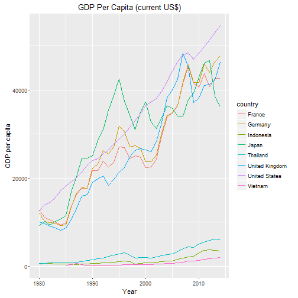

## Features 
Each year, the World Bank collects data from various sources and publish them on its website. This app
is an attempt to show the GDP per Capita of a few typical countries. In general, we have 
1. An interactive chart 
2. A summary of the GDP per Capita of the data
3. A data table to inspect each record.

---  

## Summary 
We can use `WDI`, an R package, in this project to get WDI data. Then we summarize it using the `summary` function in R 
 

```r
library(WDI)
dat <- WDI(indicator='NY.GDP.PCAP.CD', country=c('US','GB','JP','FR','DE','TH','VN','ID'), start=1980, end=2014)
summary(dat)
```

```
##     iso2c             country          NY.GDP.PCAP.CD          year     
##  Length:280         Length:280         Min.   :   97.16   Min.   :1980  
##  Class :character   Class :character   1st Qu.: 1878.80   1st Qu.:1988  
##  Mode  :character   Mode  :character   Median :17134.29   Median :1997  
##                                        Mean   :18642.74   Mean   :1997  
##                                        3rd Qu.:32832.81   3rd Qu.:2006  
##                                        Max.   :54629.50   Max.   :2014  
##                                        NA's   :5
```

---

## Chart
We can also visualize it by using `ggplot2` and `plotly`. The combination of these two library give you an interactive and beautiful chart.


```r
library(plotly)
library(ggplot2)
ggplot(data = dat, aes(year, NY.GDP.PCAP.CD, col = country)) + 
                                    geom_line() +     
                                    xlab('Year') + ylab('GDP per capita') + 
                                    labs(title = 'GDP Per Capita (current US$)')
```

```
## Warning: Removed 5 rows containing missing values (geom_path).
```



```r
ggplotly()
```

<!--html_preserve--><div id="htmlwidget-6979" style="width:504px;height:504px;" class="plotly html-widget"></div>
<script type="application/json" data-for="htmlwidget-6979">{"x":{"data":[{"x":[1980,1981,1982,1983,1984,1985,1986,1987,1988,1989,1990,1991,1992,1993,1994,1995,1996,1997,1998,1999,2000,2001,2002,2003,2004,2005,2006,2007,2008,2009,2010,2011,2012,2013,2014],"y":[12712.6013994711,11110.5597678072,10505.7354723033,10005.151671686,9432.29235681539,9775.33943453059,13557.1472150713,16324.3935591631,17696.5111500917,17704.9589834678,21795.2378254833,21782.4162038013,23937.0569176208,22503.2608510696,23625.5289969556,27037.9721319292,27015.2589591084,24359.4250618537,25101.3687369434,24799.2960096043,22465.6418414637,22527.3177509504,24275.2426027905,29691.1815836764,33874.7425478435,34879.7263291899,36544.5085344191,41600.5839748157,45413.065712185,41631.1314123702,40705.7662299421,43807.4759032413,40850.3523734948,42627.6524386524,42732.5665028093],"text":["year: 1980<br>NY.GDP.PCAP.CD: 12712.6<br>country: France","year: 1981<br>NY.GDP.PCAP.CD: 11110.56<br>country: France","year: 1982<br>NY.GDP.PCAP.CD: 10505.74<br>country: France","year: 1983<br>NY.GDP.PCAP.CD: 10005.15<br>country: France","year: 1984<br>NY.GDP.PCAP.CD: 9432.29<br>country: France","year: 1985<br>NY.GDP.PCAP.CD: 9775.34<br>country: France","year: 1986<br>NY.GDP.PCAP.CD: 13557.15<br>country: France","year: 1987<br>NY.GDP.PCAP.CD: 16324.39<br>country: France","year: 1988<br>NY.GDP.PCAP.CD: 17696.51<br>country: France","year: 1989<br>NY.GDP.PCAP.CD: 17704.96<br>country: France","year: 1990<br>NY.GDP.PCAP.CD: 21795.24<br>country: France","year: 1991<br>NY.GDP.PCAP.CD: 21782.42<br>country: France","year: 1992<br>NY.GDP.PCAP.CD: 23937.06<br>country: France","year: 1993<br>NY.GDP.PCAP.CD: 22503.26<br>country: France","year: 1994<br>NY.GDP.PCAP.CD: 23625.53<br>country: France","year: 1995<br>NY.GDP.PCAP.CD: 27037.97<br>country: France","year: 1996<br>NY.GDP.PCAP.CD: 27015.26<br>country: France","year: 1997<br>NY.GDP.PCAP.CD: 24359.43<br>country: France","year: 1998<br>NY.GDP.PCAP.CD: 25101.37<br>country: France","year: 1999<br>NY.GDP.PCAP.CD: 24799.3<br>country: France","year: 2000<br>NY.GDP.PCAP.CD: 22465.64<br>country: France","year: 2001<br>NY.GDP.PCAP.CD: 22527.32<br>country: France","year: 2002<br>NY.GDP.PCAP.CD: 24275.24<br>country: France","year: 2003<br>NY.GDP.PCAP.CD: 29691.18<br>country: France","year: 2004<br>NY.GDP.PCAP.CD: 33874.74<br>country: France","year: 2005<br>NY.GDP.PCAP.CD: 34879.73<br>country: France","year: 2006<br>NY.GDP.PCAP.CD: 36544.51<br>country: France","year: 2007<br>NY.GDP.PCAP.CD: 41600.58<br>country: France","year: 2008<br>NY.GDP.PCAP.CD: 45413.07<br>country: France","year: 2009<br>NY.GDP.PCAP.CD: 41631.13<br>country: France","year: 2010<br>NY.GDP.PCAP.CD: 40705.77<br>country: France","year: 2011<br>NY.GDP.PCAP.CD: 43807.48<br>country: France","year: 2012<br>NY.GDP.PCAP.CD: 40850.35<br>country: France","year: 2013<br>NY.GDP.PCAP.CD: 42627.65<br>country: France","year: 2014<br>NY.GDP.PCAP.CD: 42732.57<br>country: France"],"type":"scatter","mode":"lines","name":"France","line":{"width":1.88976377952756,"color":"rgb(248,118,109)","dash":"solid"},"legendgroup":"France","showlegend":true,"xaxis":"x","yaxis":"y","hoverinfo":"text"},{"x":[1980,1981,1982,1983,1984,1985,1986,1987,1988,1989,1990,1991,1992,1993,1994,1995,1996,1997,1998,1999,2000,2001,2002,2003,2004,2005,2006,2007,2008,2009,2010,2011,2012,2013,2014],"y":[12092.3818542945,10170.4462754224,9876.22823170597,9827.02240932529,9277.932299307,9393.89169050237,13410.8971003707,16614.4101036952,17863.4378971386,17697.1635135694,22219.5725271486,23269.3817972445,26333.537444515,25488.5195189314,27087.5584535617,31729.6997633451,30564.2478058387,27045.7191273318,27340.6728848884,26795.9911316814,23718.746699471,23687.3168928198,25205.164445175,30359.9521525666,34165.9340305131,34696.62091671,36447.8723183195,41814.8190965222,45699.1983232962,41732.707253158,41788.0447853084,45936.0812598523,44010.9313869814,46441.6771304417,47821.9174641231],"text":["year: 1980<br>NY.GDP.PCAP.CD: 12092.38<br>country: Germany","year: 1981<br>NY.GDP.PCAP.CD: 10170.45<br>country: Germany","year: 1982<br>NY.GDP.PCAP.CD: 9876.23<br>country: Germany","year: 1983<br>NY.GDP.PCAP.CD: 9827.02<br>country: Germany","year: 1984<br>NY.GDP.PCAP.CD: 9277.93<br>country: Germany","year: 1985<br>NY.GDP.PCAP.CD: 9393.89<br>country: Germany","year: 1986<br>NY.GDP.PCAP.CD: 13410.9<br>country: Germany","year: 1987<br>NY.GDP.PCAP.CD: 16614.41<br>country: Germany","year: 1988<br>NY.GDP.PCAP.CD: 17863.44<br>country: Germany","year: 1989<br>NY.GDP.PCAP.CD: 17697.16<br>country: Germany","year: 1990<br>NY.GDP.PCAP.CD: 22219.57<br>country: Germany","year: 1991<br>NY.GDP.PCAP.CD: 23269.38<br>country: Germany","year: 1992<br>NY.GDP.PCAP.CD: 26333.54<br>country: Germany","year: 1993<br>NY.GDP.PCAP.CD: 25488.52<br>country: Germany","year: 1994<br>NY.GDP.PCAP.CD: 27087.56<br>country: Germany","year: 1995<br>NY.GDP.PCAP.CD: 31729.7<br>country: Germany","year: 1996<br>NY.GDP.PCAP.CD: 30564.25<br>country: Germany","year: 1997<br>NY.GDP.PCAP.CD: 27045.72<br>country: Germany","year: 1998<br>NY.GDP.PCAP.CD: 27340.67<br>country: Germany","year: 1999<br>NY.GDP.PCAP.CD: 26795.99<br>country: Germany","year: 2000<br>NY.GDP.PCAP.CD: 23718.75<br>country: Germany","year: 2001<br>NY.GDP.PCAP.CD: 23687.32<br>country: Germany","year: 2002<br>NY.GDP.PCAP.CD: 25205.16<br>country: Germany","year: 2003<br>NY.GDP.PCAP.CD: 30359.95<br>country: Germany","year: 2004<br>NY.GDP.PCAP.CD: 34165.93<br>country: Germany","year: 2005<br>NY.GDP.PCAP.CD: 34696.62<br>country: Germany","year: 2006<br>NY.GDP.PCAP.CD: 36447.87<br>country: Germany","year: 2007<br>NY.GDP.PCAP.CD: 41814.82<br>country: Germany","year: 2008<br>NY.GDP.PCAP.CD: 45699.2<br>country: Germany","year: 2009<br>NY.GDP.PCAP.CD: 41732.71<br>country: Germany","year: 2010<br>NY.GDP.PCAP.CD: 41788.04<br>country: Germany","year: 2011<br>NY.GDP.PCAP.CD: 45936.08<br>country: Germany","year: 2012<br>NY.GDP.PCAP.CD: 44010.93<br>country: Germany","year: 2013<br>NY.GDP.PCAP.CD: 46441.68<br>country: Germany","year: 2014<br>NY.GDP.PCAP.CD: 47821.92<br>country: Germany"],"type":"scatter","mode":"lines","name":"Germany","line":{"width":1.88976377952756,"color":"rgb(205,150,0)","dash":"solid"},"legendgroup":"Germany","showlegend":true,"xaxis":"x","yaxis":"y","hoverinfo":"text"},{"x":[1980,1981,1982,1983,1984,1985,1986,1987,1988,1989,1990,1991,1992,1993,1994,1995,1996,1997,1998,1999,2000,2001,2002,2003,2004,2005,2006,2007,2008,2009,2010,2011,2012,2013,2014],"y":[528.937639476011,612.495620043418,613.018269526491,540.159807422709,542.305236551058,529.28739194161,475.41385954886,442.148122072982,507.355183144399,569.227170581666,630.66855677001,694.245756576301,740.917747910218,827.810348145865,912.097702939456,1026.27053440703,1137.26564794368,1063.56795617586,463.883002060677,671.005634084103,780.092078954339,748.184746113868,900.130803943843,1065.65654610135,1150.34929408933,1263.48144553621,1590.17790597325,1860.62262569343,2167.85765032782,2262.72078612573,3125.21993359966,3647.62662181143,3700.52353809447,3623.53235988707,3491.92971737141],"text":["year: 1980<br>NY.GDP.PCAP.CD: 528.94<br>country: Indonesia","year: 1981<br>NY.GDP.PCAP.CD: 612.5<br>country: Indonesia","year: 1982<br>NY.GDP.PCAP.CD: 613.02<br>country: Indonesia","year: 1983<br>NY.GDP.PCAP.CD: 540.16<br>country: Indonesia","year: 1984<br>NY.GDP.PCAP.CD: 542.31<br>country: Indonesia","year: 1985<br>NY.GDP.PCAP.CD: 529.29<br>country: Indonesia","year: 1986<br>NY.GDP.PCAP.CD: 475.41<br>country: Indonesia","year: 1987<br>NY.GDP.PCAP.CD: 442.15<br>country: Indonesia","year: 1988<br>NY.GDP.PCAP.CD: 507.36<br>country: Indonesia","year: 1989<br>NY.GDP.PCAP.CD: 569.23<br>country: Indonesia","year: 1990<br>NY.GDP.PCAP.CD: 630.67<br>country: Indonesia","year: 1991<br>NY.GDP.PCAP.CD: 694.25<br>country: Indonesia","year: 1992<br>NY.GDP.PCAP.CD: 740.92<br>country: Indonesia","year: 1993<br>NY.GDP.PCAP.CD: 827.81<br>country: Indonesia","year: 1994<br>NY.GDP.PCAP.CD: 912.1<br>country: Indonesia","year: 1995<br>NY.GDP.PCAP.CD: 1026.27<br>country: Indonesia","year: 1996<br>NY.GDP.PCAP.CD: 1137.27<br>country: Indonesia","year: 1997<br>NY.GDP.PCAP.CD: 1063.57<br>country: Indonesia","year: 1998<br>NY.GDP.PCAP.CD: 463.88<br>country: Indonesia","year: 1999<br>NY.GDP.PCAP.CD: 671.01<br>country: Indonesia","year: 2000<br>NY.GDP.PCAP.CD: 780.09<br>country: Indonesia","year: 2001<br>NY.GDP.PCAP.CD: 748.18<br>country: Indonesia","year: 2002<br>NY.GDP.PCAP.CD: 900.13<br>country: Indonesia","year: 2003<br>NY.GDP.PCAP.CD: 1065.66<br>country: Indonesia","year: 2004<br>NY.GDP.PCAP.CD: 1150.35<br>country: Indonesia","year: 2005<br>NY.GDP.PCAP.CD: 1263.48<br>country: Indonesia","year: 2006<br>NY.GDP.PCAP.CD: 1590.18<br>country: Indonesia","year: 2007<br>NY.GDP.PCAP.CD: 1860.62<br>country: Indonesia","year: 2008<br>NY.GDP.PCAP.CD: 2167.86<br>country: Indonesia","year: 2009<br>NY.GDP.PCAP.CD: 2262.72<br>country: Indonesia","year: 2010<br>NY.GDP.PCAP.CD: 3125.22<br>country: Indonesia","year: 2011<br>NY.GDP.PCAP.CD: 3647.63<br>country: Indonesia","year: 2012<br>NY.GDP.PCAP.CD: 3700.52<br>country: Indonesia","year: 2013<br>NY.GDP.PCAP.CD: 3623.53<br>country: Indonesia","year: 2014<br>NY.GDP.PCAP.CD: 3491.93<br>country: Indonesia"],"type":"scatter","mode":"lines","name":"Indonesia","line":{"width":1.88976377952756,"color":"rgb(124,174,0)","dash":"solid"},"legendgroup":"Indonesia","showlegend":true,"xaxis":"x","yaxis":"y","hoverinfo":"text"},{"x":[1980,1981,1982,1983,1984,1985,1986,1987,1988,1989,1990,1991,1992,1993,1994,1995,1996,1997,1998,1999,2000,2001,2002,2003,2004,2005,2006,2007,2008,2009,2010,2011,2012,2013,2014],"y":[9307.8392945921,10212.378135897,9428.87465037061,10213.9582793056,10786.7861809452,11465.7257816258,16882.2739520677,20355.6052224352,24592.7720053564,24505.7672958689,25123.6317862131,28540.7714825993,31013.6471483654,35451.2975115738,38814.8943789814,42522.0665906054,37422.8641429074,34304.1489712264,30969.7380327708,35004.0612719044,37299.6441291293,32716.4186748897,31235.5881843914,33690.9377297154,36441.5044939422,35781.1700525965,34075.9789494111,34033.7012549361,37865.6180313874,39322.6047284114,42909.2341523544,46203.7095189836,46679.2654322303,38633.7080591795,36194.4156134427],"text":["year: 1980<br>NY.GDP.PCAP.CD: 9307.84<br>country: Japan","year: 1981<br>NY.GDP.PCAP.CD: 10212.38<br>country: Japan","year: 1982<br>NY.GDP.PCAP.CD: 9428.87<br>country: Japan","year: 1983<br>NY.GDP.PCAP.CD: 10213.96<br>country: Japan","year: 1984<br>NY.GDP.PCAP.CD: 10786.79<br>country: Japan","year: 1985<br>NY.GDP.PCAP.CD: 11465.73<br>country: Japan","year: 1986<br>NY.GDP.PCAP.CD: 16882.27<br>country: Japan","year: 1987<br>NY.GDP.PCAP.CD: 20355.61<br>country: Japan","year: 1988<br>NY.GDP.PCAP.CD: 24592.77<br>country: Japan","year: 1989<br>NY.GDP.PCAP.CD: 24505.77<br>country: Japan","year: 1990<br>NY.GDP.PCAP.CD: 25123.63<br>country: Japan","year: 1991<br>NY.GDP.PCAP.CD: 28540.77<br>country: Japan","year: 1992<br>NY.GDP.PCAP.CD: 31013.65<br>country: Japan","year: 1993<br>NY.GDP.PCAP.CD: 35451.3<br>country: Japan","year: 1994<br>NY.GDP.PCAP.CD: 38814.89<br>country: Japan","year: 1995<br>NY.GDP.PCAP.CD: 42522.07<br>country: Japan","year: 1996<br>NY.GDP.PCAP.CD: 37422.86<br>country: Japan","year: 1997<br>NY.GDP.PCAP.CD: 34304.15<br>country: Japan","year: 1998<br>NY.GDP.PCAP.CD: 30969.74<br>country: Japan","year: 1999<br>NY.GDP.PCAP.CD: 35004.06<br>country: Japan","year: 2000<br>NY.GDP.PCAP.CD: 37299.64<br>country: Japan","year: 2001<br>NY.GDP.PCAP.CD: 32716.42<br>country: Japan","year: 2002<br>NY.GDP.PCAP.CD: 31235.59<br>country: Japan","year: 2003<br>NY.GDP.PCAP.CD: 33690.94<br>country: Japan","year: 2004<br>NY.GDP.PCAP.CD: 36441.5<br>country: Japan","year: 2005<br>NY.GDP.PCAP.CD: 35781.17<br>country: Japan","year: 2006<br>NY.GDP.PCAP.CD: 34075.98<br>country: Japan","year: 2007<br>NY.GDP.PCAP.CD: 34033.7<br>country: Japan","year: 2008<br>NY.GDP.PCAP.CD: 37865.62<br>country: Japan","year: 2009<br>NY.GDP.PCAP.CD: 39322.6<br>country: Japan","year: 2010<br>NY.GDP.PCAP.CD: 42909.23<br>country: Japan","year: 2011<br>NY.GDP.PCAP.CD: 46203.71<br>country: Japan","year: 2012<br>NY.GDP.PCAP.CD: 46679.27<br>country: Japan","year: 2013<br>NY.GDP.PCAP.CD: 38633.71<br>country: Japan","year: 2014<br>NY.GDP.PCAP.CD: 36194.42<br>country: Japan"],"type":"scatter","mode":"lines","name":"Japan","line":{"width":1.88976377952756,"color":"rgb(0,190,103)","dash":"solid"},"legendgroup":"Japan","showlegend":true,"xaxis":"x","yaxis":"y","hoverinfo":"text"},{"x":[1980,1981,1982,1983,1984,1985,1986,1987,1988,1989,1990,1991,1992,1993,1994,1995,1996,1997,1998,1999,2000,2001,2002,2003,2004,2005,2006,2007,2008,2009,2010,2011,2012,2013,2014],"y":[682.774983647363,720.899413146586,742.704332535522,797.933836842888,817.870836041917,747.494503771366,813.10411571139,936.196942750856,1122.57886232194,1294.51944552665,1508.28790943258,1716.61034821801,1929.53310757195,2213.16937914033,2497.89828544633,2856.24639161311,3056.75264552453,2480.47609083131,1855.9003833517,2043.90583224351,2016.04101466738,1896.97100344834,2093.97920641937,2349.38452566541,2643.47893487535,2874.38627417759,3351.11763286401,3962.7504988544,4384.78267515745,4231.14036778126,5111.90920222917,5539.49436810396,5917.9179338712,6229.17288577677,5977.38058711461],"text":["year: 1980<br>NY.GDP.PCAP.CD: 682.77<br>country: Thailand","year: 1981<br>NY.GDP.PCAP.CD: 720.9<br>country: Thailand","year: 1982<br>NY.GDP.PCAP.CD: 742.7<br>country: Thailand","year: 1983<br>NY.GDP.PCAP.CD: 797.93<br>country: Thailand","year: 1984<br>NY.GDP.PCAP.CD: 817.87<br>country: Thailand","year: 1985<br>NY.GDP.PCAP.CD: 747.49<br>country: Thailand","year: 1986<br>NY.GDP.PCAP.CD: 813.1<br>country: Thailand","year: 1987<br>NY.GDP.PCAP.CD: 936.2<br>country: Thailand","year: 1988<br>NY.GDP.PCAP.CD: 1122.58<br>country: Thailand","year: 1989<br>NY.GDP.PCAP.CD: 1294.52<br>country: Thailand","year: 1990<br>NY.GDP.PCAP.CD: 1508.29<br>country: Thailand","year: 1991<br>NY.GDP.PCAP.CD: 1716.61<br>country: Thailand","year: 1992<br>NY.GDP.PCAP.CD: 1929.53<br>country: Thailand","year: 1993<br>NY.GDP.PCAP.CD: 2213.17<br>country: Thailand","year: 1994<br>NY.GDP.PCAP.CD: 2497.9<br>country: Thailand","year: 1995<br>NY.GDP.PCAP.CD: 2856.25<br>country: Thailand","year: 1996<br>NY.GDP.PCAP.CD: 3056.75<br>country: Thailand","year: 1997<br>NY.GDP.PCAP.CD: 2480.48<br>country: Thailand","year: 1998<br>NY.GDP.PCAP.CD: 1855.9<br>country: Thailand","year: 1999<br>NY.GDP.PCAP.CD: 2043.91<br>country: Thailand","year: 2000<br>NY.GDP.PCAP.CD: 2016.04<br>country: Thailand","year: 2001<br>NY.GDP.PCAP.CD: 1896.97<br>country: Thailand","year: 2002<br>NY.GDP.PCAP.CD: 2093.98<br>country: Thailand","year: 2003<br>NY.GDP.PCAP.CD: 2349.38<br>country: Thailand","year: 2004<br>NY.GDP.PCAP.CD: 2643.48<br>country: Thailand","year: 2005<br>NY.GDP.PCAP.CD: 2874.39<br>country: Thailand","year: 2006<br>NY.GDP.PCAP.CD: 3351.12<br>country: Thailand","year: 2007<br>NY.GDP.PCAP.CD: 3962.75<br>country: Thailand","year: 2008<br>NY.GDP.PCAP.CD: 4384.78<br>country: Thailand","year: 2009<br>NY.GDP.PCAP.CD: 4231.14<br>country: Thailand","year: 2010<br>NY.GDP.PCAP.CD: 5111.91<br>country: Thailand","year: 2011<br>NY.GDP.PCAP.CD: 5539.49<br>country: Thailand","year: 2012<br>NY.GDP.PCAP.CD: 5917.92<br>country: Thailand","year: 2013<br>NY.GDP.PCAP.CD: 6229.17<br>country: Thailand","year: 2014<br>NY.GDP.PCAP.CD: 5977.38<br>country: Thailand"],"type":"scatter","mode":"lines","name":"Thailand","line":{"width":1.88976377952756,"color":"rgb(0,191,196)","dash":"solid"},"legendgroup":"Thailand","showlegend":true,"xaxis":"x","yaxis":"y","hoverinfo":"text"},{"x":[1980,1981,1982,1983,1984,1985,1986,1987,1988,1989,1990,1991,1992,1993,1994,1995,1996,1997,1998,1999,2000,2001,2002,2003,2004,2005,2006,2007,2008,2009,2010,2011,2012,2013,2014],"y":[10032.062080015,9599.30622221965,9146.07735701852,8691.51881306514,8179.19444064991,8652.21654247593,10611.112210096,13118.586534629,15987.1680775688,16239.2821960944,19095.4669984608,19900.7266505069,20487.1707852878,18389.0195675099,19709.2380983653,21330.276252903,22462.5094323584,24803.1474321952,26281.0477516525,26675.9155954667,26400.6564382696,25980.2203793473,28301.2083322425,32575.0919626199,38305.8726859929,40047.905967007,42534.3062613449,48428.1574527987,45195.1569273881,37166.2759654944,38292.8711313583,41020.3769643089,41294.5148008666,42309.0399221273,46331.9774103502],"text":["year: 1980<br>NY.GDP.PCAP.CD: 10032.06<br>country: United Kingdom","year: 1981<br>NY.GDP.PCAP.CD: 9599.31<br>country: United Kingdom","year: 1982<br>NY.GDP.PCAP.CD: 9146.08<br>country: United Kingdom","year: 1983<br>NY.GDP.PCAP.CD: 8691.52<br>country: United Kingdom","year: 1984<br>NY.GDP.PCAP.CD: 8179.19<br>country: United Kingdom","year: 1985<br>NY.GDP.PCAP.CD: 8652.22<br>country: United Kingdom","year: 1986<br>NY.GDP.PCAP.CD: 10611.11<br>country: United Kingdom","year: 1987<br>NY.GDP.PCAP.CD: 13118.59<br>country: United Kingdom","year: 1988<br>NY.GDP.PCAP.CD: 15987.17<br>country: United Kingdom","year: 1989<br>NY.GDP.PCAP.CD: 16239.28<br>country: United Kingdom","year: 1990<br>NY.GDP.PCAP.CD: 19095.47<br>country: United Kingdom","year: 1991<br>NY.GDP.PCAP.CD: 19900.73<br>country: United Kingdom","year: 1992<br>NY.GDP.PCAP.CD: 20487.17<br>country: United Kingdom","year: 1993<br>NY.GDP.PCAP.CD: 18389.02<br>country: United Kingdom","year: 1994<br>NY.GDP.PCAP.CD: 19709.24<br>country: United Kingdom","year: 1995<br>NY.GDP.PCAP.CD: 21330.28<br>country: United Kingdom","year: 1996<br>NY.GDP.PCAP.CD: 22462.51<br>country: United Kingdom","year: 1997<br>NY.GDP.PCAP.CD: 24803.15<br>country: United Kingdom","year: 1998<br>NY.GDP.PCAP.CD: 26281.05<br>country: United Kingdom","year: 1999<br>NY.GDP.PCAP.CD: 26675.92<br>country: United Kingdom","year: 2000<br>NY.GDP.PCAP.CD: 26400.66<br>country: United Kingdom","year: 2001<br>NY.GDP.PCAP.CD: 25980.22<br>country: United Kingdom","year: 2002<br>NY.GDP.PCAP.CD: 28301.21<br>country: United Kingdom","year: 2003<br>NY.GDP.PCAP.CD: 32575.09<br>country: United Kingdom","year: 2004<br>NY.GDP.PCAP.CD: 38305.87<br>country: United Kingdom","year: 2005<br>NY.GDP.PCAP.CD: 40047.91<br>country: United Kingdom","year: 2006<br>NY.GDP.PCAP.CD: 42534.31<br>country: United Kingdom","year: 2007<br>NY.GDP.PCAP.CD: 48428.16<br>country: United Kingdom","year: 2008<br>NY.GDP.PCAP.CD: 45195.16<br>country: United Kingdom","year: 2009<br>NY.GDP.PCAP.CD: 37166.28<br>country: United Kingdom","year: 2010<br>NY.GDP.PCAP.CD: 38292.87<br>country: United Kingdom","year: 2011<br>NY.GDP.PCAP.CD: 41020.38<br>country: United Kingdom","year: 2012<br>NY.GDP.PCAP.CD: 41294.51<br>country: United Kingdom","year: 2013<br>NY.GDP.PCAP.CD: 42309.04<br>country: United Kingdom","year: 2014<br>NY.GDP.PCAP.CD: 46331.98<br>country: United Kingdom"],"type":"scatter","mode":"lines","name":"United Kingdom","line":{"width":1.88976377952756,"color":"rgb(0,169,255)","dash":"solid"},"legendgroup":"United Kingdom","showlegend":true,"xaxis":"x","yaxis":"y","hoverinfo":"text"},{"x":[1980,1981,1982,1983,1984,1985,1986,1987,1988,1989,1990,1991,1992,1993,1994,1995,1996,1997,1998,1999,2000,2001,2002,2003,2004,2005,2006,2007,2008,2009,2010,2011,2012,2013,2014],"y":[12597.6675101771,13993.166743657,14438.9762759859,15561.4263961128,17134.2860171738,18269.4221684235,19115.05290818,20100.8588916542,21483.2330602579,22922.4370895271,23954.4793548671,24405.1648147489,25492.9516517617,26464.852511744,27776.635528226,28782.1750200918,30068.2309182833,31572.6902298492,32949.1977640346,34620.9288990826,36449.8551155349,37273.6181034176,38166.0378407812,39677.1983481058,41921.8097617892,44307.9205848603,46437.0671173065,48061.5376613353,48401.4273403899,47001.5553496818,48374.0564565966,49781.357490134,51456.6587280353,52980.0436263119,54629.4951678912],"text":["year: 1980<br>NY.GDP.PCAP.CD: 12597.67<br>country: United States","year: 1981<br>NY.GDP.PCAP.CD: 13993.17<br>country: United States","year: 1982<br>NY.GDP.PCAP.CD: 14438.98<br>country: United States","year: 1983<br>NY.GDP.PCAP.CD: 15561.43<br>country: United States","year: 1984<br>NY.GDP.PCAP.CD: 17134.29<br>country: United States","year: 1985<br>NY.GDP.PCAP.CD: 18269.42<br>country: United States","year: 1986<br>NY.GDP.PCAP.CD: 19115.05<br>country: United States","year: 1987<br>NY.GDP.PCAP.CD: 20100.86<br>country: United States","year: 1988<br>NY.GDP.PCAP.CD: 21483.23<br>country: United States","year: 1989<br>NY.GDP.PCAP.CD: 22922.44<br>country: United States","year: 1990<br>NY.GDP.PCAP.CD: 23954.48<br>country: United States","year: 1991<br>NY.GDP.PCAP.CD: 24405.16<br>country: United States","year: 1992<br>NY.GDP.PCAP.CD: 25492.95<br>country: United States","year: 1993<br>NY.GDP.PCAP.CD: 26464.85<br>country: United States","year: 1994<br>NY.GDP.PCAP.CD: 27776.64<br>country: United States","year: 1995<br>NY.GDP.PCAP.CD: 28782.18<br>country: United States","year: 1996<br>NY.GDP.PCAP.CD: 30068.23<br>country: United States","year: 1997<br>NY.GDP.PCAP.CD: 31572.69<br>country: United States","year: 1998<br>NY.GDP.PCAP.CD: 32949.2<br>country: United States","year: 1999<br>NY.GDP.PCAP.CD: 34620.93<br>country: United States","year: 2000<br>NY.GDP.PCAP.CD: 36449.86<br>country: United States","year: 2001<br>NY.GDP.PCAP.CD: 37273.62<br>country: United States","year: 2002<br>NY.GDP.PCAP.CD: 38166.04<br>country: United States","year: 2003<br>NY.GDP.PCAP.CD: 39677.2<br>country: United States","year: 2004<br>NY.GDP.PCAP.CD: 41921.81<br>country: United States","year: 2005<br>NY.GDP.PCAP.CD: 44307.92<br>country: United States","year: 2006<br>NY.GDP.PCAP.CD: 46437.07<br>country: United States","year: 2007<br>NY.GDP.PCAP.CD: 48061.54<br>country: United States","year: 2008<br>NY.GDP.PCAP.CD: 48401.43<br>country: United States","year: 2009<br>NY.GDP.PCAP.CD: 47001.56<br>country: United States","year: 2010<br>NY.GDP.PCAP.CD: 48374.06<br>country: United States","year: 2011<br>NY.GDP.PCAP.CD: 49781.36<br>country: United States","year: 2012<br>NY.GDP.PCAP.CD: 51456.66<br>country: United States","year: 2013<br>NY.GDP.PCAP.CD: 52980.04<br>country: United States","year: 2014<br>NY.GDP.PCAP.CD: 54629.5<br>country: United States"],"type":"scatter","mode":"lines","name":"United States","line":{"width":1.88976377952756,"color":"rgb(199,124,255)","dash":"solid"},"legendgroup":"United States","showlegend":true,"xaxis":"x","yaxis":"y","hoverinfo":"text"},{"x":[1980,1981,1982,1983,1984,1985,1986,1987,1988,1989,1990,1991,1992,1993,1994,1995,1996,1997,1998,1999,2000,2001,2002,2003,2004,2005,2006,2007,2008,2009,2010,2011,2012,2013,2014],"y":[null,null,null,null,null,239.428695209592,437.129543435461,593.6535735904,401.87491099611,97.1578850638901,98.0318690016233,142.965889882784,144.148658604128,189.260516107791,229.954805103072,288.020277867905,337.05006283199,361.25448830082,360.600798022492,374.476420064783,433.3337076797,448.882279778256,477.105876263106,530.861849364997,606.904378261988,699.499778976363,796.671573774518,919.209265568078,1164.61252461712,1232.36967118834,1333.58352635481,1543.02695033023,1755.26542357512,1908.64033992167,2052.29420172228],"text":["year: 1980<br>NY.GDP.PCAP.CD: NA<br>country: Vietnam","year: 1981<br>NY.GDP.PCAP.CD: NA<br>country: Vietnam","year: 1982<br>NY.GDP.PCAP.CD: NA<br>country: Vietnam","year: 1983<br>NY.GDP.PCAP.CD: NA<br>country: Vietnam","year: 1984<br>NY.GDP.PCAP.CD: NA<br>country: Vietnam","year: 1985<br>NY.GDP.PCAP.CD: 239.43<br>country: Vietnam","year: 1986<br>NY.GDP.PCAP.CD: 437.13<br>country: Vietnam","year: 1987<br>NY.GDP.PCAP.CD: 593.65<br>country: Vietnam","year: 1988<br>NY.GDP.PCAP.CD: 401.87<br>country: Vietnam","year: 1989<br>NY.GDP.PCAP.CD: 97.16<br>country: Vietnam","year: 1990<br>NY.GDP.PCAP.CD: 98.03<br>country: Vietnam","year: 1991<br>NY.GDP.PCAP.CD: 142.97<br>country: Vietnam","year: 1992<br>NY.GDP.PCAP.CD: 144.15<br>country: Vietnam","year: 1993<br>NY.GDP.PCAP.CD: 189.26<br>country: Vietnam","year: 1994<br>NY.GDP.PCAP.CD: 229.95<br>country: Vietnam","year: 1995<br>NY.GDP.PCAP.CD: 288.02<br>country: Vietnam","year: 1996<br>NY.GDP.PCAP.CD: 337.05<br>country: Vietnam","year: 1997<br>NY.GDP.PCAP.CD: 361.25<br>country: Vietnam","year: 1998<br>NY.GDP.PCAP.CD: 360.6<br>country: Vietnam","year: 1999<br>NY.GDP.PCAP.CD: 374.48<br>country: Vietnam","year: 2000<br>NY.GDP.PCAP.CD: 433.33<br>country: Vietnam","year: 2001<br>NY.GDP.PCAP.CD: 448.88<br>country: Vietnam","year: 2002<br>NY.GDP.PCAP.CD: 477.11<br>country: Vietnam","year: 2003<br>NY.GDP.PCAP.CD: 530.86<br>country: Vietnam","year: 2004<br>NY.GDP.PCAP.CD: 606.9<br>country: Vietnam","year: 2005<br>NY.GDP.PCAP.CD: 699.5<br>country: Vietnam","year: 2006<br>NY.GDP.PCAP.CD: 796.67<br>country: Vietnam","year: 2007<br>NY.GDP.PCAP.CD: 919.21<br>country: Vietnam","year: 2008<br>NY.GDP.PCAP.CD: 1164.61<br>country: Vietnam","year: 2009<br>NY.GDP.PCAP.CD: 1232.37<br>country: Vietnam","year: 2010<br>NY.GDP.PCAP.CD: 1333.58<br>country: Vietnam","year: 2011<br>NY.GDP.PCAP.CD: 1543.03<br>country: Vietnam","year: 2012<br>NY.GDP.PCAP.CD: 1755.27<br>country: Vietnam","year: 2013<br>NY.GDP.PCAP.CD: 1908.64<br>country: Vietnam","year: 2014<br>NY.GDP.PCAP.CD: 2052.29<br>country: Vietnam"],"type":"scatter","mode":"lines","name":"Vietnam","line":{"width":1.88976377952756,"color":"rgb(255,97,204)","dash":"solid"},"legendgroup":"Vietnam","showlegend":true,"xaxis":"x","yaxis":"y","hoverinfo":"text"}],"layout":{"margin":{"b":37.2602739726027,"l":54.7945205479452,"t":40.8401826484018,"r":7.30593607305936},"plot_bgcolor":"rgb(235,235,235)","paper_bgcolor":"rgb(255,255,255)","font":{"color":"rgb(0,0,0)","family":"","size":14.6118721461187},"title":"GDP Per Capita (current US$)","titlefont":{"color":"rgb(0,0,0)","family":"","size":17.5342465753425},"xaxis":{"type":"linear","autorange":false,"tickmode":"array","range":[1978.3,2015.7],"ticktext":["1980","1990","2000","2010"],"tickvals":[1980,1990,2000,2010],"ticks":"outside","tickcolor":"rgb(51,51,51)","ticklen":3.65296803652968,"tickwidth":0.66417600664176,"showticklabels":true,"tickfont":{"color":"rgb(77,77,77)","family":"","size":11.689497716895},"tickangle":-0,"showline":false,"linecolor":null,"linewidth":0,"showgrid":true,"domain":[0,1],"gridcolor":"rgb(255,255,255)","gridwidth":0.66417600664176,"zeroline":false,"anchor":"y","hoverformat":".2f"},"annotations":[{"text":"Year","x":0.5,"y":-0.0589802130898021,"showarrow":false,"ax":0,"ay":0,"font":{"color":"rgb(0,0,0)","family":"","size":14.6118721461187},"xref":"paper","yref":"paper","textangle":-0,"xanchor":"center","yanchor":"middle"},{"text":"GDP per capita","x":-0.104642313546423,"y":0.5,"showarrow":false,"ax":0,"ay":0,"font":{"color":"rgb(0,0,0)","family":"","size":14.6118721461187},"xref":"paper","yref":"paper","textangle":-90,"xanchor":"center","yanchor":"middle"},{"text":"country","x":1.02,"y":1,"showarrow":false,"ax":0,"ay":0,"font":{"color":"rgb(0,0,0)","family":"","size":14.6118721461187},"xref":"paper","yref":"paper","textangle":-0,"xanchor":"left","yanchor":"top"}],"yaxis":{"type":"linear","autorange":false,"tickmode":"array","range":[-2629.45897907748,57356.1120320326],"ticktext":["0","20000","40000"],"tickvals":[0,20000,40000],"ticks":"outside","tickcolor":"rgb(51,51,51)","ticklen":3.65296803652968,"tickwidth":0.66417600664176,"showticklabels":true,"tickfont":{"color":"rgb(77,77,77)","family":"","size":11.689497716895},"tickangle":-0,"showline":false,"linecolor":null,"linewidth":0,"showgrid":true,"domain":[0,1],"gridcolor":"rgb(255,255,255)","gridwidth":0.66417600664176,"zeroline":false,"anchor":"x","hoverformat":".2f"},"shapes":[{"type":"rect","fillcolor":null,"line":{"color":null,"width":0,"linetype":[]},"yref":"paper","xref":"paper","x0":0,"x1":1,"y0":0,"y1":1}],"showlegend":true,"legend":{"bgcolor":"rgb(255,255,255)","bordercolor":"transparent","borderwidth":1.88976377952756,"font":{"color":"rgb(0,0,0)","family":"","size":11.689497716895},"y":0.938132733408324},"hovermode":"closest"},"source":"A","config":{"modeBarButtonsToRemove":["sendDataToCloud"]},"base_url":"https://plot.ly"},"evals":[],"jsHooks":[]}</script><!--/html_preserve-->

---

## Data table
We can easily make a beautiful data table with `DT` package.


```r
library(DT)
datatable(data = dat)
```

<!--html_preserve--><div id="htmlwidget-928" style="width:100%;height:auto;" class="datatables html-widget"></div>
<script type="application/json" data-for="htmlwidget-928">{"x":{"filter":"none","data":[["1","2","3","4","5","6","7","8","9","10","11","12","13","14","15","16","17","18","19","20","21","22","23","24","25","26","27","28","29","30","31","32","33","34","35","36","37","38","39","40","41","42","43","44","45","46","47","48","49","50","51","52","53","54","55","56","57","58","59","60","61","62","63","64","65","66","67","68","69","70","71","72","73","74","75","76","77","78","79","80","81","82","83","84","85","86","87","88","89","90","91","92","93","94","95","96","97","98","99","100","101","102","103","104","105","106","107","108","109","110","111","112","113","114","115","116","117","118","119","120","121","122","123","124","125","126","127","128","129","130","131","132","133","134","135","136","137","138","139","140","141","142","143","144","145","146","147","148","149","150","151","152","153","154","155","156","157","158","159","160","161","162","163","164","165","166","167","168","169","170","171","172","173","174","175","176","177","178","179","180","181","182","183","184","185","186","187","188","189","190","191","192","193","194","195","196","197","198","199","200","201","202","203","204","205","206","207","208","209","210","211","212","213","214","215","216","217","218","219","220","221","222","223","224","225","226","227","228","229","230","231","232","233","234","235","236","237","238","239","240","241","242","243","244","245","246","247","248","249","250","251","252","253","254","255","256","257","258","259","260","261","262","263","264","265","266","267","268","269","270","271","272","273","274","275","276","277","278","279","280"],["DE","DE","DE","DE","DE","DE","DE","DE","DE","DE","DE","DE","DE","DE","DE","DE","DE","DE","DE","DE","DE","DE","DE","DE","DE","DE","DE","DE","DE","DE","DE","DE","DE","DE","DE","FR","FR","FR","FR","FR","FR","FR","FR","FR","FR","FR","FR","FR","FR","FR","FR","FR","FR","FR","FR","FR","FR","FR","FR","FR","FR","FR","FR","FR","FR","FR","FR","FR","FR","FR","GB","GB","GB","GB","GB","GB","GB","GB","GB","GB","GB","GB","GB","GB","GB","GB","GB","GB","GB","GB","GB","GB","GB","GB","GB","GB","GB","GB","GB","GB","GB","GB","GB","GB","GB","ID","ID","ID","ID","ID","ID","ID","ID","ID","ID","ID","ID","ID","ID","ID","ID","ID","ID","ID","ID","ID","ID","ID","ID","ID","ID","ID","ID","ID","ID","ID","ID","ID","ID","ID","JP","JP","JP","JP","JP","JP","JP","JP","JP","JP","JP","JP","JP","JP","JP","JP","JP","JP","JP","JP","JP","JP","JP","JP","JP","JP","JP","JP","JP","JP","JP","JP","JP","JP","JP","TH","TH","TH","TH","TH","TH","TH","TH","TH","TH","TH","TH","TH","TH","TH","TH","TH","TH","TH","TH","TH","TH","TH","TH","TH","TH","TH","TH","TH","TH","TH","TH","TH","TH","TH","US","US","US","US","US","US","US","US","US","US","US","US","US","US","US","US","US","US","US","US","US","US","US","US","US","US","US","US","US","US","US","US","US","US","US","VN","VN","VN","VN","VN","VN","VN","VN","VN","VN","VN","VN","VN","VN","VN","VN","VN","VN","VN","VN","VN","VN","VN","VN","VN","VN","VN","VN","VN","VN","VN","VN","VN","VN","VN"],["Germany","Germany","Germany","Germany","Germany","Germany","Germany","Germany","Germany","Germany","Germany","Germany","Germany","Germany","Germany","Germany","Germany","Germany","Germany","Germany","Germany","Germany","Germany","Germany","Germany","Germany","Germany","Germany","Germany","Germany","Germany","Germany","Germany","Germany","Germany","France","France","France","France","France","France","France","France","France","France","France","France","France","France","France","France","France","France","France","France","France","France","France","France","France","France","France","France","France","France","France","France","France","France","France","United Kingdom","United Kingdom","United Kingdom","United Kingdom","United Kingdom","United Kingdom","United Kingdom","United Kingdom","United Kingdom","United Kingdom","United Kingdom","United Kingdom","United Kingdom","United Kingdom","United Kingdom","United Kingdom","United Kingdom","United Kingdom","United Kingdom","United Kingdom","United Kingdom","United Kingdom","United Kingdom","United Kingdom","United Kingdom","United Kingdom","United Kingdom","United Kingdom","United Kingdom","United Kingdom","United Kingdom","United Kingdom","United Kingdom","United Kingdom","United Kingdom","Indonesia","Indonesia","Indonesia","Indonesia","Indonesia","Indonesia","Indonesia","Indonesia","Indonesia","Indonesia","Indonesia","Indonesia","Indonesia","Indonesia","Indonesia","Indonesia","Indonesia","Indonesia","Indonesia","Indonesia","Indonesia","Indonesia","Indonesia","Indonesia","Indonesia","Indonesia","Indonesia","Indonesia","Indonesia","Indonesia","Indonesia","Indonesia","Indonesia","Indonesia","Indonesia","Japan","Japan","Japan","Japan","Japan","Japan","Japan","Japan","Japan","Japan","Japan","Japan","Japan","Japan","Japan","Japan","Japan","Japan","Japan","Japan","Japan","Japan","Japan","Japan","Japan","Japan","Japan","Japan","Japan","Japan","Japan","Japan","Japan","Japan","Japan","Thailand","Thailand","Thailand","Thailand","Thailand","Thailand","Thailand","Thailand","Thailand","Thailand","Thailand","Thailand","Thailand","Thailand","Thailand","Thailand","Thailand","Thailand","Thailand","Thailand","Thailand","Thailand","Thailand","Thailand","Thailand","Thailand","Thailand","Thailand","Thailand","Thailand","Thailand","Thailand","Thailand","Thailand","Thailand","United States","United States","United States","United States","United States","United States","United States","United States","United States","United States","United States","United States","United States","United States","United States","United States","United States","United States","United States","United States","United States","United States","United States","United States","United States","United States","United States","United States","United States","United States","United States","United States","United States","United States","United States","Vietnam","Vietnam","Vietnam","Vietnam","Vietnam","Vietnam","Vietnam","Vietnam","Vietnam","Vietnam","Vietnam","Vietnam","Vietnam","Vietnam","Vietnam","Vietnam","Vietnam","Vietnam","Vietnam","Vietnam","Vietnam","Vietnam","Vietnam","Vietnam","Vietnam","Vietnam","Vietnam","Vietnam","Vietnam","Vietnam","Vietnam","Vietnam","Vietnam","Vietnam","Vietnam"],[47821.9174641231,46441.6771304417,44010.9313869814,45936.0812598523,41788.0447853084,41732.707253158,45699.1983232962,41814.8190965222,36447.8723183195,34696.62091671,34165.9340305131,30359.9521525666,25205.164445175,23687.3168928198,23718.746699471,26795.9911316814,27340.6728848884,27045.7191273318,30564.2478058387,31729.6997633451,27087.5584535617,25488.5195189314,26333.537444515,23269.3817972445,22219.5725271486,17697.1635135694,17863.4378971386,16614.4101036952,13410.8971003707,9393.89169050237,9277.932299307,9827.02240932529,9876.22823170597,10170.4462754224,12092.3818542945,42732.5665028093,42627.6524386524,40850.3523734948,43807.4759032413,40705.7662299421,41631.1314123702,45413.065712185,41600.5839748157,36544.5085344191,34879.7263291899,33874.7425478435,29691.1815836764,24275.2426027905,22527.3177509504,22465.6418414637,24799.2960096043,25101.3687369434,24359.4250618537,27015.2589591084,27037.9721319292,23625.5289969556,22503.2608510696,23937.0569176208,21782.4162038013,21795.2378254833,17704.9589834678,17696.5111500917,16324.3935591631,13557.1472150713,9775.33943453059,9432.29235681539,10005.151671686,10505.7354723033,11110.5597678072,12712.6013994711,46331.9774103502,42309.0399221273,41294.5148008666,41020.3769643089,38292.8711313583,37166.2759654944,45195.1569273881,48428.1574527987,42534.3062613449,40047.905967007,38305.8726859929,32575.0919626199,28301.2083322425,25980.2203793473,26400.6564382696,26675.9155954667,26281.0477516525,24803.1474321952,22462.5094323584,21330.276252903,19709.2380983653,18389.0195675099,20487.1707852878,19900.7266505069,19095.4669984608,16239.2821960944,15987.1680775688,13118.586534629,10611.112210096,8652.21654247593,8179.19444064991,8691.51881306514,9146.07735701852,9599.30622221965,10032.062080015,3491.92971737141,3623.53235988707,3700.52353809447,3647.62662181143,3125.21993359966,2262.72078612573,2167.85765032782,1860.62262569343,1590.17790597325,1263.48144553621,1150.34929408933,1065.65654610135,900.130803943843,748.184746113868,780.092078954339,671.005634084103,463.883002060677,1063.56795617586,1137.26564794368,1026.27053440703,912.097702939456,827.810348145865,740.917747910218,694.245756576301,630.66855677001,569.227170581666,507.355183144399,442.148122072982,475.41385954886,529.28739194161,542.305236551058,540.159807422709,613.018269526491,612.495620043418,528.937639476011,36194.4156134427,38633.7080591795,46679.2654322303,46203.7095189836,42909.2341523544,39322.6047284114,37865.6180313874,34033.7012549361,34075.9789494111,35781.1700525965,36441.5044939422,33690.9377297154,31235.5881843914,32716.4186748897,37299.6441291293,35004.0612719044,30969.7380327708,34304.1489712264,37422.8641429074,42522.0665906054,38814.8943789814,35451.2975115738,31013.6471483654,28540.7714825993,25123.6317862131,24505.7672958689,24592.7720053564,20355.6052224352,16882.2739520677,11465.7257816258,10786.7861809452,10213.9582793056,9428.87465037061,10212.378135897,9307.8392945921,5977.38058711461,6229.17288577677,5917.9179338712,5539.49436810396,5111.90920222917,4231.14036778126,4384.78267515745,3962.7504988544,3351.11763286401,2874.38627417759,2643.47893487535,2349.38452566541,2093.97920641937,1896.97100344834,2016.04101466738,2043.90583224351,1855.9003833517,2480.47609083131,3056.75264552453,2856.24639161311,2497.89828544633,2213.16937914033,1929.53310757195,1716.61034821801,1508.28790943258,1294.51944552665,1122.57886232194,936.196942750856,813.10411571139,747.494503771366,817.870836041917,797.933836842888,742.704332535522,720.899413146586,682.774983647363,54629.4951678912,52980.0436263119,51456.6587280353,49781.357490134,48374.0564565966,47001.5553496818,48401.4273403899,48061.5376613353,46437.0671173065,44307.9205848603,41921.8097617892,39677.1983481058,38166.0378407812,37273.6181034176,36449.8551155349,34620.9288990826,32949.1977640346,31572.6902298492,30068.2309182833,28782.1750200918,27776.635528226,26464.852511744,25492.9516517617,24405.1648147489,23954.4793548671,22922.4370895271,21483.2330602579,20100.8588916542,19115.05290818,18269.4221684235,17134.2860171738,15561.4263961128,14438.9762759859,13993.166743657,12597.6675101771,2052.29420172228,1908.64033992167,1755.26542357512,1543.02695033023,1333.58352635481,1232.36967118834,1164.61252461712,919.209265568078,796.671573774518,699.499778976363,606.904378261988,530.861849364997,477.105876263106,448.882279778256,433.3337076797,374.476420064783,360.600798022492,361.25448830082,337.05006283199,288.020277867905,229.954805103072,189.260516107791,144.148658604128,142.965889882784,98.0318690016233,97.1578850638901,401.87491099611,593.6535735904,437.129543435461,239.428695209592,null,null,null,null,null],[2014,2013,2012,2011,2010,2009,2008,2007,2006,2005,2004,2003,2002,2001,2000,1999,1998,1997,1996,1995,1994,1993,1992,1991,1990,1989,1988,1987,1986,1985,1984,1983,1982,1981,1980,2014,2013,2012,2011,2010,2009,2008,2007,2006,2005,2004,2003,2002,2001,2000,1999,1998,1997,1996,1995,1994,1993,1992,1991,1990,1989,1988,1987,1986,1985,1984,1983,1982,1981,1980,2014,2013,2012,2011,2010,2009,2008,2007,2006,2005,2004,2003,2002,2001,2000,1999,1998,1997,1996,1995,1994,1993,1992,1991,1990,1989,1988,1987,1986,1985,1984,1983,1982,1981,1980,2014,2013,2012,2011,2010,2009,2008,2007,2006,2005,2004,2003,2002,2001,2000,1999,1998,1997,1996,1995,1994,1993,1992,1991,1990,1989,1988,1987,1986,1985,1984,1983,1982,1981,1980,2014,2013,2012,2011,2010,2009,2008,2007,2006,2005,2004,2003,2002,2001,2000,1999,1998,1997,1996,1995,1994,1993,1992,1991,1990,1989,1988,1987,1986,1985,1984,1983,1982,1981,1980,2014,2013,2012,2011,2010,2009,2008,2007,2006,2005,2004,2003,2002,2001,2000,1999,1998,1997,1996,1995,1994,1993,1992,1991,1990,1989,1988,1987,1986,1985,1984,1983,1982,1981,1980,2014,2013,2012,2011,2010,2009,2008,2007,2006,2005,2004,2003,2002,2001,2000,1999,1998,1997,1996,1995,1994,1993,1992,1991,1990,1989,1988,1987,1986,1985,1984,1983,1982,1981,1980,2014,2013,2012,2011,2010,2009,2008,2007,2006,2005,2004,2003,2002,2001,2000,1999,1998,1997,1996,1995,1994,1993,1992,1991,1990,1989,1988,1987,1986,1985,1984,1983,1982,1981,1980]],"container":"<table class=\"display\">\n  <thead>\n    <tr>\n      <th> \u003c/th>\n      <th>iso2c\u003c/th>\n      <th>country\u003c/th>\n      <th>NY.GDP.PCAP.CD\u003c/th>\n      <th>year\u003c/th>\n    \u003c/tr>\n  \u003c/thead>\n\u003c/table>","options":{"columnDefs":[{"className":"dt-right","targets":[3,4]},{"orderable":false,"targets":0}],"order":[],"autoWidth":false,"orderClasses":false},"selection":{"mode":"multiple","selected":null,"target":"row"}},"evals":[],"jsHooks":[]}</script><!--/html_preserve-->


